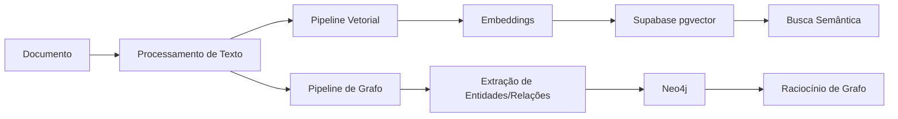

# Pipeline de Ingestão: CouncilIA GraphRAG (Dual-Indexing)

Para que o GraphRAG funcione, a ingestão de arquivos deixa de ser um processo simples de "picotar texto" e passa a ser um processo de **Extração de Conhecimento Estruturado**.

---

## 1. Fluxo de Ingestão em Duas Camadas

Quando um usuário sobe um documento (PDF, Docx, TXT), o sistema dispara dois processos paralelos:

---

## 2. Detalhamento Técnica (Camada de Grafo)

### A. Extração de Entidades (Node Extraction)
O LLM percorre o texto buscando conceitos-chave. Para o CouncilIA, as entidades obrigatórias são:
- **Agente:** Quem executa ou é afetado (ex: Produtor, Empresa).
- **Norma:** Leis, decretos, resoluções (ex: Lei 12.651).
- **Risco:** Ameaças potenciais (ex: Estiagem, Multa Ambiental).
- **Localização:** Jurisdição afetada (ex: Cerrado, Brasil).

### B. Extração de Relacionamentos (Edge Extraction)
O LLM identifica como as entidades se conectam.
- *Exemplo:* `[Lei 12.651]` -- `PROÍBE` -> `[Desmatamento em APP]`.
- *Exemplo:* `[Solo Arenoso]` -- `AUMENTA_RISCO` -> `[Erosão]`.

---

## 3. Ferramentas para Implementar a Ingestão

| Etapa | Ferramenta Sugerida | Vantagem |
| :--- | :--- | :--- |
| **Parsing de PDF** | **Unstructured.io** | A melhor para extrair tabelas e manter a estrutura hierárquica do texto. |
| **Extração de Grafo** | **LangChain `LLMGraphTransformer`** | Transforma texto em documentos de grafo (Nós/Arestas) de forma automática. |
| **Orquestração** | **QStash (Workflow)** | Como a extração de grafo é lenta/cara, o QStash garante que o processo rode em background sem travar o app. |

---

## 4. Onde os arquivos ficam fisicamente?
- **O Arquivo Bruto:** Continua no **Supabase Storage** (como você já faz).
- **A "Inteligência" do Arquivo:** 
    - Os vetores ficam no `pgvector` do Supabase.
    - O conhecimento estruturado (quem é quem e quem manda em quem) fica no Neo4j.

## 5. Por que fazer assim?
Ao adotar esse modelo, quando uma persona do CouncilIA (ex: o Auditor) faz uma pergunta, o sistema não traz apenas "o parágrafo que parece com a pergunta". Ele traz "o parágrafo relevante **E** o mapa de quais leis e riscos estão conectados a ele".

---

**Protocolo de Ingestão:** v1.0 (Graph-Enhanced)  
**Autor:** Senior AI Architect
