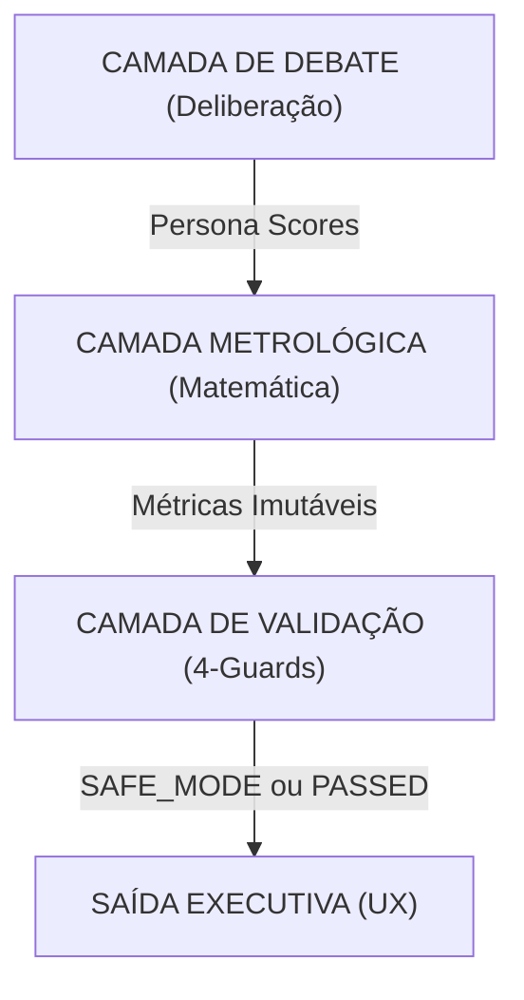

# CouncilIA v7.3.1: Sistema Universal de Decisão (Especificação Científica)

**Status:** Produção Hardened v7.3.1  
**Classificação:** Documento Executivo de Auditoria  
**Público-alvo:** Alta Liderança, Auditores Regulatórios, Gestores de Risco

---

## 1. Resumo Executivo: A Evolução da IA Deliberativa

O CouncilIA v7.3.1 marca a transição de saídas heurísticas de IA para um **Sistema Metrológico Determinístico de Decisão**. Ao contrário dos LLMs padrão que geram narrativa e métricas simultaneamente (o que leva a alucinações e contradições lógicas), o CouncilIA v7.3.1 separa a **Camada de Lógica Matemática** da **Camada de Narrativa Semântica**.

### A Mudança Fundamental de Paradigma:
- **v7.2 (Legado):** Foco na narrativa. O LLM sugere scores com base em sua própria "impressão".
- **v7.3.1 (Atual):** Foco na verdade. O motor matemático dita a verdade; o LLM é restrito a sintetizar a fundamentação com base em métricas imutáveis.

---

## 2. Metodologia Científica: O Protocolo de Camada Tripla

O sistema opera em um pipeline de 3 estágios projetado para eliminar vieses e garantir a densidade de evidências.

### Estágio 1: Deliberação Adversarial (ML Adversarial)
6 personas de IA especializadas (Visionário, Tecnologista, Auditor, Mercado, Eticista, Financeiro) interagem em um protocolo de 3 rodadas:
- **Rodada 1 (Tese):** Análise independente e isolada.
- **Rodada 2 (Antítese):** Emparelhamento adversarial (Atacante vs Defensor).
- **Rodada 3 (Síntese):** Refinamento e isolamento final de riscos.

---

## 3. Fundamentos Matemáticos: Scoring Determinístico

O motor (`scoring.ts`) calcula as métricas usando modelos estatísticos compatíveis com normas ISO.

### 3.1 Força do Consenso ($\Theta$)
O consenso não é uma média simples. É uma medida da **Variância Inversa** entre as 6 personas.

$$ \sigma = \sqrt{\frac{\sum (x_i - \mu)^2}{N}} $$
$$ \Theta = \max(0, 100 - (\sigma \times 2)) $$

*Onde:*  
- $\sigma$ = Desvio Padrão dos scores.  
- $\Theta$ = 100% significa alinhamento total.  
- $\Theta$ < 40% dispara uma flag de **Consenso Fraco**.

### 3.2 Value at Risk (VaR) / Valor em Risco
O VaR é uma função de penalidade multidimensional baseada em:
1. **Range de Dissent ($\Delta$):** A distância entre a persona mais otimista e a mais pessimista.
2. **Riscos Não Resolvidos ($R$):** Contagem de riscos críticos sinalizados na Rodada 3.
3. **Densidade de Evidência ($E$):** Razão entre alegações suportadas por RAG e suposições não comprovadas.

$$ VaR = (\Delta \times w_d) + (R \times w_r) + (E \times w_e) $$

---

## 4. O Protocolo de Validação 4-Guard

Para evitar "Vazamentos de Lógica" da IA, cada saída passa por 4 guardiões automatizados.

| Guardião | Lógica | Efeito de Disparo |
| :--- | :--- | :--- |
| **1. Inconsistência de Score** | Se Score > 75 mas Consenso < 50% | **BLOQUEIA DASHBOARD** |
| **2. Vazamento Neutro** | Se todas as personas reportarem exatamente 50/100 | **ATIVA SAFE MODE** |
| **3. Gap de Evidência** | Se citações RAG < 2 em domínios críticos | **VEREDITO CONDICIONAL** |
| **4. Viés Solo** | Se uma persona desvia >50 pontos sem justificativa | **INVALIDA SAÍDA** |

---

## 5. Componentes de Suporte à Decisão (UX Truth-First)

### 5.1 Kill Conditions (Showstoppers)
Razões explícitas e inegociáveis para interromper um projeto. Diferente de "Riscos", as Kill Conditions são **Bloqueadores Absolutos** definidos por regulações locais (ex: SISAC para Agro, LGPD para privacidade).

### 5.2 Roadmap Institucional SMART
Substitui o "Alliance Tension Map" por uma tabela de execução estruturada:
- **S**pecific (Ação Específica)
- **M**easurable (Critério de Sucesso Mensurável)
- **A**uditable (Responsável Auditável)
- **R**egulatory (Prazo Regulatório)
- **T**echnical (Escopo Técnico)

---

## 6. Conformidade e Governança

O CouncilIA v7.3.1 alinha-se aos padrões globais de governança de IA:
- **EU AI Act:** Atende aos requisitos de transparência e supervisão humana para IA de alto risco.
- **LGPD / GDPR:** Implementa direitos automatizados dos titulares e retenção regulatória (5-7 anos).
- **Integridade Metrológica:** Segue os princípios da ISO/IEC 17025 para incerteza de medição em suporte à decisão.

---

**Versão do Protocolo:** 7.3.1  
**Hashes de Integridade:** Verificado via `npm run build`  
**Sistema Live em:** councilia.com
