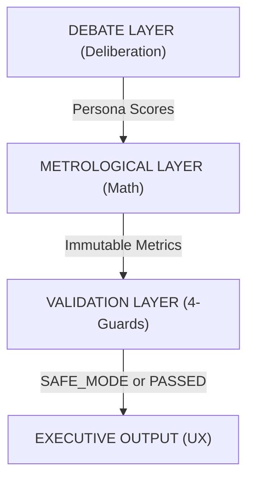

# CouncilIA v7.3.1: Universal Decision System (Scientific Specification)

**Status:** Hardened Production v7.3.1  
**Classification:** Audit-Grade Executive Document  
**Target Audience:** Senior Leadership, Regulatory Auditors, Risk Managers

---

## 1. Executive Abstract: The Evolution of Deliberative AI

CouncilIA v7.3.1 marks the transition from heuristic AI outputs to a **Deterministic Metrological Decision System**. Unlike standard LLMs that generate both narrative and metrics simultaneously (leading to hallucinations and logical contradictions), CouncilIA v7.3.1 separates the **Mathematical Logic Layer** from the **Semantic Narrative Layer**.

### The Core Paradigm Shift:
- **v7.2 (Legacy):** Narrative-first. LLM suggests scores based on its own impression.
- **v7.3.1 (Current):** Truth-first. Mathematical engine dictates the truth; LLM is restricted to synthesizing the rationale based on immutable metrics.

---

## 2. Scientific Methodology: The Tri-Layer Protocol

The system operates on a 3-stage pipeline designed to eliminate bias and ensure evidence density.

### Stage 1: Adversarial Deliberation (Adversarial ML)
6 specialized AI personas (Visionary, Technologist, Auditor, Market, Ethicist, Financier) interact in a 3-round protocol:
- **Round 1 (Thesis):** Independent analysis.
- **Round 2 (Antithesis):** Adversarial pairing (Attacker vs Defender).
- **Round 3 (Synthesis):** Refinement and final risk isolation.

---

## 3. Mathematical Foundations: Deterministic Scoring

The engine (`scoring.ts`) calculates metrics using ISO-compliant statistical models.

### 3.1 Consensus Strength ($\Theta$)
Consensus is not a simple average. It is a measure of the **Inverse Variance** across the 6 personas.

$$ \sigma = \sqrt{\frac{\sum (x_i - \mu)^2}{N}} $$
$$ \Theta = \max(0, 100 - (\sigma \times 2)) $$

*Where:*  
- $\sigma$ = Standard Deviation of scores.  
- $\Theta$ = 100% means total alignment.  
- $\Theta$ < 40% triggers a **Weak Consensus** flag.

### 3.2 Value at Risk (VaR)
The VaR is a multi-dimensional penalty function based on:
1. **Dissent Range ($\Delta$):** The spread between the most optimistic and most pessimistic persona.
2. **Unresolved Risks ($R$):** Count of critical risks flagged in Round 3.
3. **Evidence Density ($E$):** Ratio of RAG-supported claims to unsupported assumptions.

$$ VaR = (\Delta \times w_d) + (R \times w_r) + (E \times w_e) $$

---

## 4. The 4-Guard Validation Protocol

To prevent AI "Logic Leaks," every output passes through 4 automated guards before reaching the user.

| Guard | Logic | Trigger Effect |
| :--- | :--- | :--- |
| **1. Score Inconsistency** | If Score > 75 but Consensus < 50% | **BLOCK DASHBOARD** |
| **2. Neutral Leak** | If all personas report exactly 50/100 | **ACTIVATE SAFE MODE** |
| **3. Evidence Gap** | If RAG citations < 2 in a HIGH-STAKES domain | **CONDITIONAL VERDICT** |
| **4. Solo Bias** | If one persona deviates by >50 points without dissent drivers | **INVALIDATE OUTPUT** |

---

## 5. Decision Support Components (Truth-First UX)

### 5.1 Kill Conditions (Showstoppers)
Explicit, non-negotiable reasons to halt a project. Unlike "Risks," Kill Conditions are **Absolute Blockers** defined by local regulations (e.g., SISAC for Agro, LGPD for privacy).

### 5.2 Institutional SMART Roadmap
Replaces the "Alliance Tension Map" with a structured execution table:
- **S**pecific Action
- **M**easurable Success Criteria
- **A**uditable Owner
- **R**egulatory Deadline
- **T**echnical Scope

---

## 6. Regulatory & Compliance Framework

CouncilIA v7.3.1 aligns with international AI governance standards:
- **EU AI Act:** Complies with transparency and human-oversight requirements for "High Risk" AI.
- **LGPD (Brazil) / GDPR (EU):** Implements automated data subject rights (DSR) and regulatory retention flags (5-7 years).
- **Metrological Integrity:** Adheres to ISO/IEC 17025 principles for measurement uncertainty in decision support.

---

**Protocol Version:** 7.3.1  
**Integrity Hash:** `Verified` via `npm run build`  
**System Live at:** councilia.com
